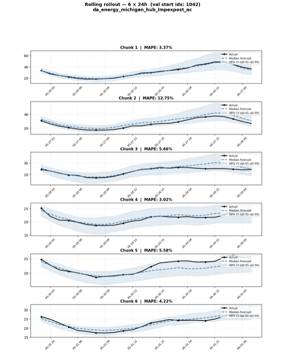
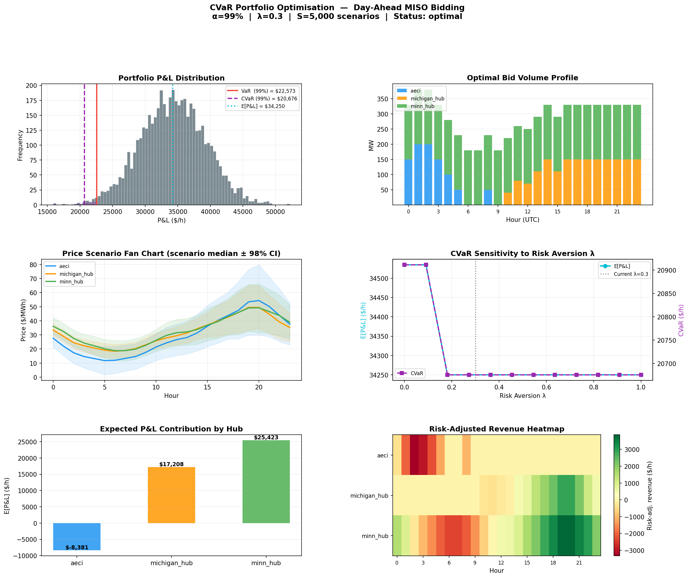

# Energy Forecasting Pipeline ?

A **production-ready** time series energy forecasting system using **Chronos2 Model** with FastAPI, Streamlit, and complete ML pipeline orchestration.

## Features

? **Complete ML Pipeline**
- Chronos2 model from DARTS for accurate time series forecasting
- AutoML fine-tuning with AdamW optimizer
- Comprehensive feature engineering (lag features, rolling statistics)
- Train/val/test splitting with proper time series validation

? **REST API**
- FastAPI-based REST API with Swagger documentation
- Async request handling
- Comprehensive error handling and logging
- Health checks and model status endpoints

? **Interactive Dashboard**
- Streamlit-based web interface
- Real-time model training monitoring
- Interactive forecasting interface
- Performance visualization and metrics tracking

? **Production Ready**
- Docker containerization support
- Comprehensive configuration management (YAML)
- Structured logging and monitoring
- ONNX model export support
- Checkpoint management and model versioning

## Quick Start

### 1. Installation

```bash
# Clone the repository
cd energy_forecast

# Install dependencies
pip install -r requirements.txt
```

### 2. Configuration

Update `config/config.yaml` with your settings:

```yaml
data:
  data_path: "/path/to/your/data.parquet"
  target_columns:
    - "energy_column_1"
    - "energy_column_2"
  train_split: 0.85

model:
  input_chunk_length: 168
  output_chunk_length: 24
  hub_model_name: "autogluon/chronos-2-small"

training:
  batch_size: 4
  n_epochs: 20
  learning_rate: 1e-5
  optimizer: "adamw"
```

### 3. Train the Model

```bash
# Using CLI
python main.py train --data-path /path/to/data.parquet

# Or with custom config
python main.py train --config config/config.yaml --output-dir outputs
```

### 4. Make Predictions

```bash
python main.py predict \
  --data-path /path/to/data.parquet \
  --target-col "energy_column_1" \
  --num-chunks 6
```

### 5. Run API Server

```bash
# Start FastAPI server
python main.py api --host 0.0.0.0 --port 8000

# Or with uvicorn directly
uvicorn src.api.api:app --reload --host 0.0.0.0 --port 8000
```

### 6. Launch Dashboard

```bash
python main.py dashboard
# Or directly:
streamlit run app.py
```

## Screenshots & Visualizations

### Forecasts Dashboard
Real-time visualization of energy price predictions with quantile confidence intervals:



### CVaR Analysis Dashboard
Conditional Value at Risk analysis for risk assessment and portfolio optimization:



## Project Structure

```
energy_forecast/
+-- src/
|   +-- api/                      # FastAPI application
|   |   +-- api.py                # Main API endpoints
|   |   +-- schemas.py            # Request/response schemas
|   +-- components/               # ML components
|   |   +-- data_processor.py     # Data loading & feature engineering
|   |   +-- model_trainer.py      # Model training logic
|   |   +-- predictor.py          # Prediction logic
|   |   +-- evaluator.py          # Evaluation metrics
|   +-- config/                   # Configuration management
|   |   +-- configuration.py      # Config classes
|   +-- entity/                   # Data entities
|   |   +-- config_entity.py      # Entity classes
|   +-- pipeline/                 # Pipeline orchestration
|   |   +-- training_pipeline.py  # Training workflow
|   |   +-- inference_pipeline.py # Inference workflow
|   +-- utils/                    # Utilities
|   |   +-- common.py             # Helper functions
|   +-- constants/                # Constants
|       +-- __init__.py           # Project constants
+-- config/
|   +-- config.yaml               # Configuration file
+-- app.py                        # Streamlit app
+-- main.py                       # CLI entry point
+-- requirements.txt              # Dependencies
+-- setup.py                      # Package setup
+-- README.md                     # Documentation
+-- research/
    +-- trials.ipynb              # Jupyter notebook
```

## API Endpoints

### Health Check
```bash
GET /health
```
Response: `{"status": "healthy", "version": "1.0.0"}`

### Get Configuration
```bash
GET /config
```
Returns current model and training configuration

### Training
```bash
POST /train
Content-Type: application/json

{
  "data_path": "/path/to/data.parquet",
  "output_dir": "outputs",
  "config_path": "config/config.yaml"
}
```

### Predictions
```bash
POST /predict
Content-Type: application/json

{
  "data_path": "/path/to/data.parquet",
  "target_column": "energy_column",
  "num_chunks": 6,
  "seed": 42
}
```

## Configuration Reference

### Data Configuration
- `data_path`: Path to parquet file with time series data
- `target_columns`: List of columns to forecast
- `lag_set`: Lag features to create [1, 2, 3, 6, 12, 24]
- `rolling_windows`: Rolling window sizes [3, 6, 12, 24]
- `train_split`: Train/val split ratio (0.85 = 85% train)
- `freq`: Data frequency ('H' for hourly)

### Model Configuration
- `input_chunk_length`: Look-back window (168 hours = 1 week)
- `output_chunk_length`: Forecast horizon (24 hours = 1 day)
- `hub_model_name`: Hugging Face model ("autogluon/chronos-2-small")
- `likelihood_quantiles`: Quantile predictions [0.1, 0.5, 0.9]

### Training Configuration
- `batch_size`: Training batch size
- `n_epochs`: Number of training epochs
- `warmup_epochs`: Learning rate warmup epochs
- `learning_rate`: Initial learning rate
- `weight_decay`: L2 regularization
- `optimizer`: Adam/AdamW
- `early_stopping_patience`: Early stopping patience

## Performance Metrics

The system tracks:
- **MAPE** (Mean Absolute Percentage Error)
- **MAE** (Mean Absolute Error)
- **RMSE** (Root Mean Squared Error)
- **Chunk-wise MAPE**: Performance for each prediction chunk

## Key Dependencies

- **darts**: Time series library with Chronos2
- **fastapi**: Modern web framework
- **streamlit**: Interactive dashboards
- **pytorch-lightning**: Training framework
- **pandas/numpy**: Data processing
- **pydantic**: Data validation

## Development

```bash
# Run tests
pytest tests/

# Code formatting
black src/
isort src/

# Linting
pylint src/
```

## Troubleshooting

**API won't start**
```bash
# Check port availability
lsof -i :8000

# Try different port
python main.py api --port 8001
```

**Model not found error**
```bash
# Train the model first
python main.py train --data-path /path/to/data.parquet

# Check outputs directory
ls -la outputs/
```

**Memory issues during training**
```bash
# Reduce batch size in config.yaml
batch_size: 2  # instead of 4
```

## License

MIT License

## Support

For issues and questions, please open an issue on the repository.
|   |   +-- configuration.py
|   +-- pipeline/         # Training and inference pipelines
|   |   +-- __init__.py
|   |   +-- training_pipeline.py
|   |   +-- inference_pipeline.py
|   +-- entity/           # Data entities
|   |   +-- __init__.py
|   |   +-- config_entity.py
|   +-- utils/            # Utility functions
|   |   +-- __init__.py
|   |   +-- common.py
|   +-- constants/        # Constants
|       +-- __init__.py
|       +-- __init__.py
+-- config/
|   +-- config.yaml       # Main configuration
|   +-- params.yaml       # Training parameters
|   +-- schema.yaml       # Data schema
+-- outputs/              # Model outputs (created during training)
+-- app.py                # Streamlit interface
+-- main.py               # CLI entry point
+-- requirements.txt      # Dependencies
+-- setup.py              # Package setup
```

## Installation

```bash
cd energy_forecast

# Create virtual environment
python -m venv venv
source venv/bin/activate  # Linux/Mac
# or
venv\Scripts\activate     # Windows

# Install dependencies
pip install -r requirements.txt

# Install package
pip install -e .
```

## Quick Start

### 1. Start the API Server

```bash
cd energy_forecast
python -m uvicorn src.api.api:app --host 0.0.0.0 --port 8000
```

### 2. Start the Streamlit Dashboard

```bash
streamlit run app.py
```

### 3. Train the Model (CLI)

```bash
python main.py train --data-path /path/to/data.parquet --output-dir outputs
```

### 4. Make Predictions (CLI)

```bash
python main.py predict --data-path /path/to/data.parquet --target-col da_energy_aeci_lmpexpost_ac
```

## Configuration

Edit `config/config.yaml` to customize:

- **Data**: Path, target columns, feature engineering parameters
- **Model**: Input/output chunk lengths, model name, quantiles
- **Training**: Batch size, epochs, learning rate, early stopping
- **Prediction**: Number of chunks, output length

## API Endpoints

### GET `/`
Root endpoint with API information

### GET `/health`
Health check

### POST `/predict`
Make predictions

**Request:**
```json
{
  "data_path": "/path/to/data.parquet",
  "target_col": "da_energy_aeci_lmpexpost_ac",
  "num_chunks": 6
}
```

### POST `/train`
Train the model

**Request:**
```json
{
  "data_path": "/path/to/data.parquet",
  "output_dir": "outputs"
}
```

### GET `/metrics`
Get evaluation metrics

## Dashboard Features

- **Home**: Overview and quick status
- **Predictions**: Make real-time predictions
- **Training**: Retrain model with new data
- **Metrics**: View evaluation metrics and plots

## Model Performance

The model achieves the following MAPE on validation data:

====================================================================
  MAPE SUMMARY  --  median forecast  (q0.5)
====================================================================
             Chunk 1 Chunk 2 Chunk 3 Chunk 4 Chunk 5 Chunk 6 Overall
Hub                                                                 
aeci           14.8%   50.2%   10.2%    5.1%   10.1%    4.2%   15.8%
michigan_hub    3.4%   12.8%    5.7%    3.0%    5.6%    4.2%    5.8%
minn_hub        7.5%   23.5%   19.0%    8.4%    9.9%    3.3%   11.9%
====================================================================

## Deployment

### Docker

```bash
docker build -t energy-forecast .
docker run -p 8000:8000 -p 8501:8501 energy-forecast
```

### Production

1. Train model on server
2. Export to ONNX for faster inference
3. Deploy API with gunicorn + nginx
4. Use Streamlit for monitoring dashboard

## License

MIT License

## Contact

For questions or issues, please contact the Energy Forecasting Team.
